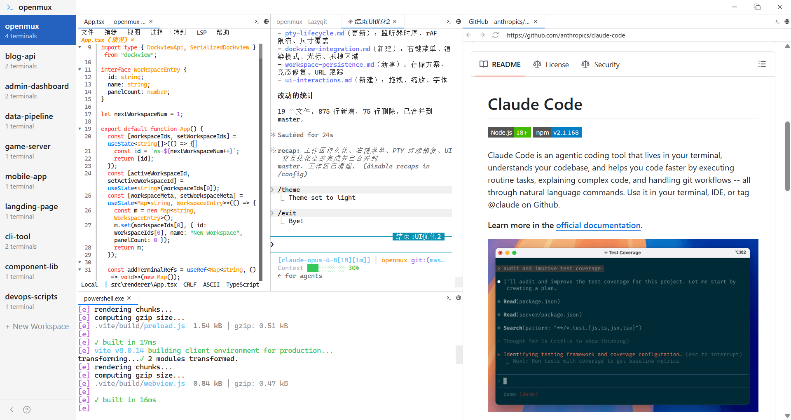

# openmux

Windows 上专为 AI 编程开发的终端工作台。

## 为什么有 openmux

Mac 上有 [cmux](https://github.com/manaflow-ai/cmux) 这样的 AI 编程终端，既有终端多路复用（multiplexer），又可以内嵌浏览器。但回到 Windows 发现没有类似产品。openmux 就是来填这个空的。

## 核心特性

- **多工作区** — 独立工作空间，每个保留独立的分屏布局，切换不中断后台进程
- **分屏布局** — 水平/垂直分割面板，拖拽调整大小
- **内嵌浏览器** — 面板中直接浏览网页，独立 session 隔离
- **cmux 风格面板** — 标签页、拖拽分屏、右键菜单，与 cmux 操作习惯一致
- **布局持久化** — 关闭自动保存工作区布局，启动时恢复面板排列

## 安装

从 [Releases](https://github.com/langxke/openmux/releases) 页面下载最新安装包，运行安装即可。

## 使用方式

### 快捷键

| 快捷键 | 功能 |
|--------|------|
| `Ctrl+B` | 折叠/展开侧边栏 |
| `Ctrl+N` | 新建终端（工作区空白时可用） |
| `Ctrl+Shift+N` | 新建工作区 |
| `Ctrl+=` / `Ctrl++` | 放大（终端字号 / UI 缩放） |
| `Ctrl+-` | 缩小 |
| `Ctrl+0` | 重置缩放 |

### 鼠标操作

双击标签栏空白处可快速新建终端。

## 许可证

[GPL-3.0](LICENSE)
